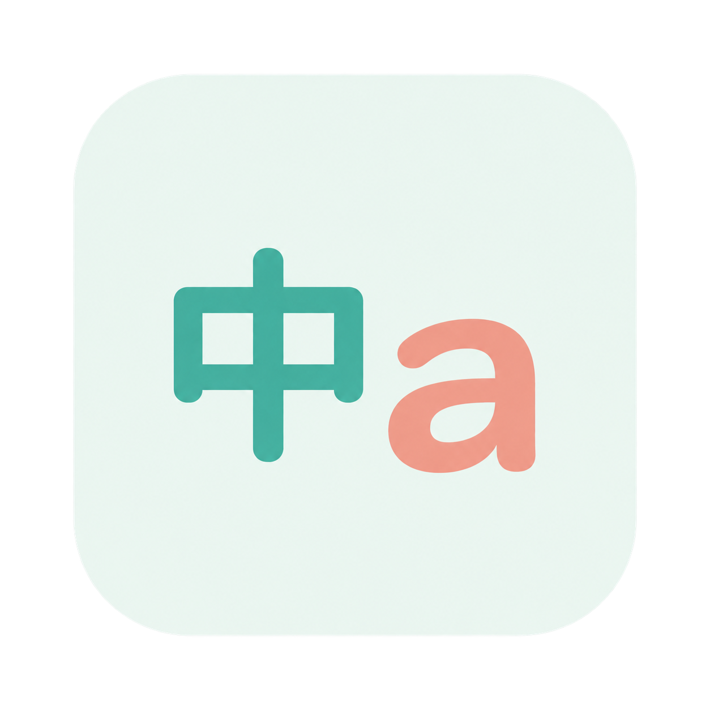

# 中英提示 · InputMethodPrompt

[](https://github.com/ChenYunerer/input_method_prompt_macos/actions/workflows/build-release.yml)
[](https://github.com/ChenYunerer/input_method_prompt_macos/releases/latest)



一个原生 macOS 菜单栏小工具，让你随时知道当前是 **中文、英文还是大写锁定**。支持屏幕中央切换提示、全屏常驻标识和鼠标跟随标识，三种模式可独立开启。

**[下载最新构建](https://github.com/ChenYunerer/input_method_prompt_macos/releases/latest)** · [全部构建版本](https://github.com/ChenYunerer/input_method_prompt_macos/releases) · [构建记录](https://github.com/ChenYunerer/input_method_prompt_macos/actions/workflows/build-release.yml) · [PRD](app/docs/PRD.md) · [技术方案](app/docs/TECHNICAL_DESIGN.md)

## 功能一览

| 功能 | 行为 |
| --- | --- |
| 切换提示 | 输入状态变化时，在鼠标所在屏幕中央显示「中 / a / A」，淡入 0.12 秒、默认停留 1 秒（可调）、淡出 0.18 秒 |
| 全屏常驻 | 全屏时持续显示当前状态，无需先切换输入法；支持九宫格位置和最高 500% 大小 |
| 鼠标跟随 | 在指针旁显示状态，跨屏跟随，靠近边缘自动换侧；不跟随文本插入光标 |
| 自动避让 | 全屏标识在鼠标移入时淡化；鼠标标识在指针隐藏或静止时隐藏/淡化 |
| 隐藏后切换提醒 | 鼠标标识隐藏或淡化时，切换输入法/大小写会临时展示新状态，随后按当前策略恢复 |
| 外观设置 | 三种提示均为无描边、无窗口阴影的圆角正方形；支持独立透明度、常驻与鼠标标识大小设置 |
| 登录启动 | 使用 macOS 原生登录项，显示真实系统状态，用户主动开启后生效 |
| 轻量运行 | Swift + AppKit，无第三方运行依赖；不抢输入焦点，提示窗口不拦截点击 |

## 下载与安装

要求 **macOS 13 或更高版本**。在苹果菜单 →「关于本机」中查看芯片类型，然后从 [Releases](https://github.com/ChenYunerer/input_method_prompt_macos/releases/latest) 的 **Assets** 下载对应 ZIP：

| 你的 Mac | 下载文件后缀 |
| --- | --- |
| Apple Silicon，M 系列芯片 | `-arm64.zip` |
| Intel 处理器 | `-x86_64.zip` |

1. 解压 ZIP，将 **中英提示.app** 拖到「应用程序」。
2. 双击启动，菜单栏会显示当前输入状态；应用不常驻 Dock。
3. 点击菜单栏状态 →「设置…」，调整提示方式和外观。
4. 如需自动启动，在「通用」中开启「登录时自动启动」。先将应用放在固定位置，再开启登录项。

下载应用 ZIP 即可运行，不需要安装 Swift 或 Xcode。GitHub 自动附带的 **Source code (zip / tar.gz)** 是源码，不是可运行应用。Releases 可直接下载；Actions 页的 Artifacts 通常需要登录 GitHub，保留 30 天。

### 首次启动被 macOS 阻止

当前下载包使用 **ad-hoc 临时签名，尚未使用 Developer ID 签名或通过 Apple 公证**。首次打开可能出现无法验证开发者等提示。确认来自本仓库后，先尝试打开应用，再到「系统设置 → 隐私与安全性」选择「仍要打开」。不需要关闭系统 Gatekeeper。

如果提示应用损坏，先重新下载并核对校验值；仍有问题时请附 macOS 版本、芯片类型和下载文件名提交 [Issue](https://github.com/ChenYunerer/input_method_prompt_macos/issues)。

### 更新与卸载

更新时，先从菜单栏退出「中英提示」，替换「应用程序」中的旧应用，再重新打开。现有偏好会保留；目前没有自动更新功能。卸载前关闭登录时自动启动，退出后删除应用即可。

## 使用与设置

不需要配置新的快捷键，使用系统已有的中英文切换方式，例如地球键、Control + Space，或已经设为中英文切换的 Caps Lock。通过菜单切换输入源也会更新提示。

| 标识 | 含义 |
| --- | --- |
| `中` | 中文输入源，Caps Lock 关闭 |
| `a` | 英文输入源，Caps Lock 关闭；菜单栏显示 `EN` |
| `A` | Caps Lock 已开启；菜单栏显示 `⇪` |
| `日` / `한` / 其他 | 对应语言标识；无法识别时显示 `⌨` |

按住 Shift 的临时大写不会触发提示。系统的输入源与 Caps Lock 状态可能先后变化，程序会做短暂确认，减少中文切换英文时先闪出 `A` 再显示 `a` 的情况。

菜单栏提供「显示当前输入法」「设置…」「退出中英提示」。手动显示只展示状态，不替你切换输入法；关闭自动切换提示后，手动显示仍然可用。

### 设置总表

所有外观、开关和静止策略修改后自动保存，三种提示互不依赖。

| 分类 | 设置 | 默认值 | 可调范围 |
| --- | --- | --- | --- |
| 切换提示 | 启用 | 开启 | 开 / 关 |
| 切换提示 | 背景透明度 | 22% | 0–100%，只改变背景，保留文字 |
| 切换提示 | 停留时长 | 1 秒 | 0.1–10 秒，步进 0.1 秒 |
| 全屏常驻 | 启用 | 开启 | 开 / 关 |
| 全屏常驻 | 背景透明度 | 45% | 0–100%，只改变背景，保留文字 |
| 全屏常驻 | 大小 | 100%，36 × 36 pt | 75–500%，每步 5% |
| 全屏常驻 | 位置 | 右上 | 九宫格位置 |
| 鼠标跟随 | 启用 | 开启 | 开 / 关 |
| 鼠标跟随 | 整体透明度 | 50% | 0–100%，文字与背景一起变淡 |
| 鼠标跟随 | 大小 | 100%，27 × 27 pt | 50–300%，每步 5% |
| 鼠标跟随 | 静止时长 | 3 秒 | 1–60 整数秒 |
| 鼠标跟随 | 静止后 | 隐藏 | 隐藏 / 淡化至正常不透明度的 20% |
| 通用 | 登录时自动启动 | 首次使用不主动注册 | 读取系统登录项的实际状态 |

透明度数值越大越透明。鼠标标识设为 100% 时完全隐藏并停止跟随监听；中央和全屏的 100% 背景透明度仍保留文字。

「恢复默认外观」仅恢复当前分类的透明度和可调大小，不更改启用开关、全屏位置、鼠标静止时长/行为、切换提示停留时长或登录项。

切换提示的「停留时长」指完全显示后的时间，不包含淡入淡出。输入数值后按回车或结束编辑保存，下一次提示或预览生效；当前正在显示的一轮保持原计时。无效输入恢复已有值，关闭切换提示后禁用时长控件并保留设置。鼠标旁切换提示的停留仍独立为 0.5 秒。

### 全屏与鼠标跟随的细节

- 中央提示固定为 148 × 148 pt，位于显示时鼠标所在屏幕中央，暂不支持位置和大小自定义。
- 全屏提示每屏独立显示，避开刘海安全区。Chrome 工具栏和网页内容拆成多个窗口的全屏场景有专门的几何识别支持。
- 鼠标提示优先在指针右下方；边缘空间不足时自动换侧，并留出恢复余量，减少临界位置抖动。
- 鼠标隐藏/恢复、静止隐藏/淡化均有淡入淡出；macOS 14+ 按屏幕刷新节奏跟随，macOS 13 使用事件合并兼容路径。
- 鼠标标识隐藏或淡化后，确认的输入状态变化会让它临时恢复正常亮度，停留 0.5 秒后重新判断当前策略。连续切换延长展示，切换本身不重置静止计时。
- 关闭鼠标跟随、整体透明度为 100%、没有有效输入状态或匹配屏幕时，输入状态切换不会强制显示标识。
- 登录项如果显示「等待系统允许」，通过设置页的「打开登录项」进入系统设置处理；开关亮起不等于已经获得系统批准。

### 输入法提示不准确时

1.11.1 在输入源通知之外，每 2 秒校准一次，并在应用切换、Space 切换和唤醒后重新确认状态，减少漏通知造成的旧状态残留。校准仍经过防闪确认；2 秒不是严格延迟上限。

在“设置 → 通用”点击“复制诊断信息”，可获取当前输入源、公开模式 ID、Caps Lock 和应用/系统版本。报告区分最近确认状态与即时读取，不包含输入文本，不会自动上传。反馈问题时请附上报告、输入法名称/版本、切换按键与复现步骤；报告反映复制时刻，打开设置可能改变输入环境。

## 隐私与兼容边界

应用不联网、不上传数据、不读取输入文本、不记录完整按键或鼠标轨迹，当前实现不请求辅助功能、输入监控或屏幕录制权限。配置只保存在本机。

主要支持系统自带「简体拼音 ↔ ABC」以及 Caps Lock。部分第三方输入法内部用 Shift 切换中英文，却不改变系统输入源，因此无法可靠识别这种内部模式。

全屏识别依据可见窗口几何，可能把隐藏菜单栏和 Dock 后恰好铺满屏幕的普通窗口识别为全屏。特殊游戏、自绘透明指针、多显示器组合及不同系统版本仍存在兼容边界。系统指针隐藏检测依赖可选的旧系统接口；不可用时设置页会说明，静止功能继续工作。

双架构构建成功不等于所有 macOS 13+ 设备都完成了实机验收。详细测试依据和未验证场景见 [PRD 验收清单](app/docs/PRD.md) 和 [性能与稳定性记录](app/docs/PERFORMANCE_STABILITY.md)。

## 从源码构建

需要 macOS、Swift 5.9+ 和 Xcode Command Line Tools；无第三方依赖。从仓库根目录执行：

```sh
git clone https://github.com/ChenYunerer/input_method_prompt_macos.git
cd input_method_prompt_macos
bash app/scripts/build-app.sh
open "dist/中英提示.app"
```

若未安装开发工具，先执行 `xcode-select --install`。本地构建默认针对当前机器架构，生成图标、release 二进制、应用包及临时签名。

自定义输出位置：

```sh
INPUT_PROMPT_APP_DIR="$PWD/dist/custom/中英提示.app" bash app/scripts/build-app.sh
```

生成与 CI 相同结构的下载包、构建元数据和校验文件：

```sh
bash app/scripts/package-release.sh
```

输出位于 `dist/releases/`，不会替换正在使用的 `dist/中英提示.app`。脚本会重新构建并检查架构、签名、ZIP 解压后的签名和可执行权限。

### 测试与诊断

```sh
# 常规回归（需要 macOS 图形登录会话，包含短暂浮层展示）
bash app/scripts/test.sh

# 输入状态可靠性专项
bash app/scripts/test.sh --input-state-only

# 鼠标隐藏后切换展示、性能与稳定性专项
bash app/scripts/test.sh --switch-reveal-only
bash app/scripts/test.sh --performance-only
bash app/scripts/test.sh --switching-duration-only

# 读取当前输入状态 / 检查真实浮层动画
"dist/中英提示.app/Contents/MacOS/InputMethodPrompt" --diagnose
"dist/中英提示.app/Contents/MacOS/InputMethodPrompt" --self-test
```

可选系统集成测试会影响当前桌面，执行时请暂停输入：

```sh
TEST_CURSOR_VISIBILITY=1 bash app/scripts/test.sh  # 隐藏/恢复真实指针
TEST_FULLSCREEN=1 bash app/scripts/test.sh         # 测试窗口进入/退出全屏
TEST_SYSTEM_INPUT_SWITCH=1 bash app/scripts/test.sh # 切换并恢复系统输入源
```

## GitHub Actions 自动构建与下载

配置入口：[`.github/workflows/build-release.yml`](.github/workflows/build-release.yml)。GitHub 要求工作流放在仓库根目录的 `.github/workflows/`；构建和发布脚本仍放在 `app/scripts/`。

1. 每次向 `main` 或 `master` **push**，构建该次 push 最终提交的完整源码；也支持在 Actions 页面手动运行这两个分支。一次 push 含多个 commit 时只构建该 push 的最终提交。
2. 使用 macOS 15 的 Apple Silicon 与 Intel runner，分别执行常规回归、release 编译、应用签名和打包校验。
3. 将两个架构的 ZIP、JSON 元数据和 SHA-256 文件上传为 Actions Artifacts，保留 30 天；测试日志保留 14 天。
4. 两个架构均成功后，核对版本、提交和构建批次，创建独立的 GitHub Release，上传完整附件后公开。任一架构失败则不发布下载版本。
5. 默认分支当前最新提交的成功构建标记为 Latest；其他分支或较早提交保留独立下载页，不覆盖默认分支的最新入口。应用本身不会自动升级。

Release 标签格式为 `ci-运行ID-重试序号`。下载文件包含应用版本、应用构建号、CI 批次、12 位提交 SHA 和架构，例如：

```text
InputMethodPrompt-v1.10.0-build28-ci1.1-<commit>-arm64.zip
InputMethodPrompt-v1.10.0-build28-ci1.1-<commit>-arm64.json
InputMethodPrompt-v1.10.0-build28-ci1.1-<commit>-arm64.sha256
```

应用版本和构建号来自 `app/scripts/build-app.sh` 生成的 `Info.plist`；功能版本升级时修改脚本中的对应字段。每次提交不会擅自递增应用语义版本，CI 批次和提交 SHA 用于区分同一版本的不同源码构建。

校验时，将同名 ZIP、JSON 和 `.sha256` 放在同一目录执行：

```sh
shasum -a 256 -c InputMethodPrompt-*.sha256
```

工作流仅发布任务拥有 `contents: write` 权限，使用仓库自带的 `GITHUB_TOKEN`，无需配置个人访问令牌或签名密钥。首次运行失败可在 Actions 对应步骤查看日志；如果仓库策略限制 Release 写入，需要管理员允许该工作流所声明的权限。

## 工程结构

```text
input_method_prompt_macos/
├── README.md
├── .github/workflows/build-release.yml  # GitHub 工作流固定入口
├── app/
│   ├── Package.swift
│   ├── Sources/InputMethodPrompt/       # 应用源码
│   ├── Tests/                          # 回归与集成检查
│   ├── Assets/                         # 图标源文件
│   ├── scripts/                        # 构建、打包、发布、测试脚本
│   └── docs/                           # PRD、技术方案、性能记录
└── dist/                               # 本地产物，不提交 Git
```

构建缓存位于 `app/.build/`，与 `dist/` 一同排除在 Git 之外。开发细节见 [工程说明](app/README.md)；问题反馈请使用 [Issues](https://github.com/ChenYunerer/input_method_prompt_macos/issues)，并附上应用版本、macOS 版本、芯片类型及复现步骤。
