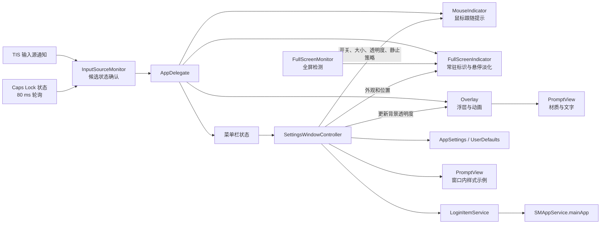
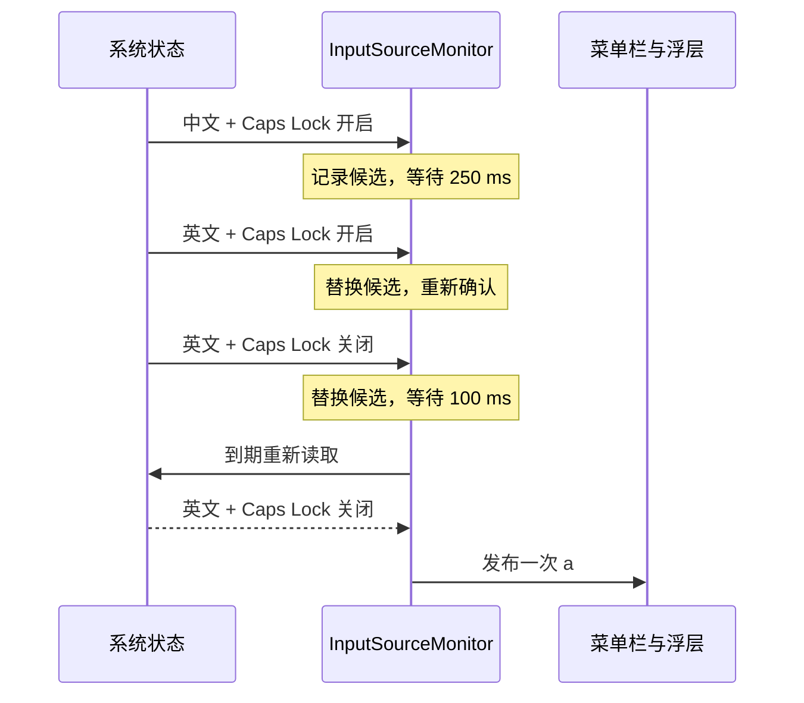
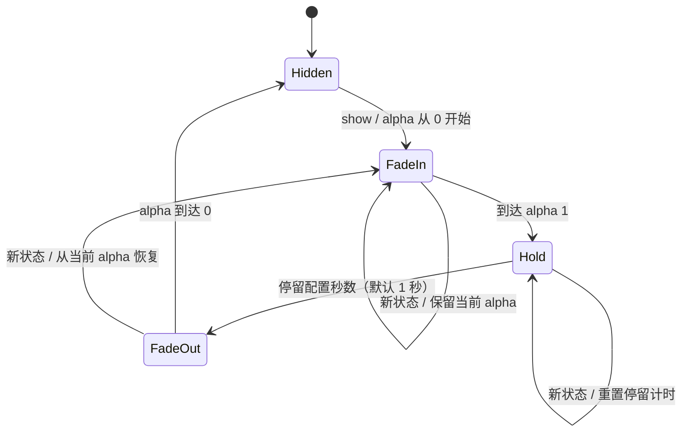

# 中英提示 — 技术方案

| 项目 | 内容 |
| --- | --- |
| 实现基线 | 本地应用代码恢复至 `76e5a0a`（1.11.0 / 构建号 29），保留 `19fcd9d` 的仅 arm64 发布策略 |
| 整理日期 | 2026-09-22 |
| 需求基线 | [PRD](PRD.md) |
| 源码仓库 | [ChenYunerer/input_method_prompt_macos](https://github.com/ChenYunerer/input_method_prompt_macos)，公开仓库，默认分支 `main` |
| 本轮范围 | 撤回 P0 的状态校准、生命周期刷新、模式元数据、设置页诊断入口与扩展报告 |
| 下载入口 | [最新构建](https://github.com/ChenYunerer/input_method_prompt_macos/releases/latest)，历史回执见第 18 节 |

第 1–14 节描述当前实现；第 15 节及第 16 节保留演进过程，版本标题下的旧行为仅用于解释改动。当前鼠标显示策略以第 16.9–16.12 节和 PRD 为准，验证记录注明其所属版本。

本次撤回 P0，已将本机应用替换为 1.11.0 / 构建 29 并重启，11 项已有偏好保持一致。推送 `main` 后由 arm64 工作流构建下载包；发布是否完成以对应提交的 Actions / Release 回执为准，历史 1.11.1 下载包保留。

## 1. 方案概述

使用 Swift + AppKit 构建原生菜单栏应用。Carbon TIS 提供当前输入源及变更通知；CoreGraphics 提供 Caps Lock 状态；监测器合并变化并确认候选状态，再驱动菜单栏与非激活浮层。

浮层的背景透明度与整窗动画分开控制。配置通过 `UserDefaults` 保存；自动启动通过 `SMAppService.mainApp` 管理；构建过程生成多尺寸 `.icns` 并打包本地 `.app`。没有第三方运行依赖、服务端或网络请求。



## 2. 工程结构与模块职责

所有工程内容位于 `app/`，根目录保留入口说明与忽略的构建产物。下图以 GitHub 仓库名展示，现有本地目录名不受仓库更名影响。

```text
input_method_prompt_macos/
├── README.md
├── app/
│   ├── Package.swift
│   ├── Sources/InputMethodPrompt/
│   │   ├── App.swift
│   │   ├── InputSource.swift
│   │   ├── FullScreenIndicator.swift
│   │   ├── MouseIndicator.swift
│   │   ├── MouseFrameClock.swift
│   │   ├── Overlay.swift
│   │   ├── PromptView.swift
│   │   ├── Settings.swift
│   │   ├── LoginItem.swift
│   │   └── SelfCheck.swift
│   ├── Tests/InputMethodPromptTests.swift
│   ├── Assets/AppIcon.png
│   ├── Assets/README.md
│   ├── scripts/{build-app,build-icon,test}.sh
│   ├── docs/{PRD,TECHNICAL_DESIGN,PERFORMANCE_STABILITY}.md
│   ├── .build/                  # 当前构建缓存，不纳入 Git
│   └── .build-previous/         # 目录整理前的缓存，不纳入 Git
└── dist/中英提示.app           # 默认输出，不纳入 Git
```

| 模块 | 职责 | 对应需求 |
| --- | --- | --- |
| [App.swift](../Sources/InputMethodPrompt/App.swift) | 生命周期、菜单、单实例检查、模块装配、独立提示开关 | R02、R05 |
| [InputSource.swift](../Sources/InputMethodPrompt/InputSource.swift) | 输入源读取、语言映射、Caps Lock、状态合并与确认 | R01、R04 |
| [FullScreenIndicator.swift](../Sources/InputMethodPrompt/FullScreenIndicator.swift) | 全屏几何检测、通知与轮询、每屏常驻标识 | R09 |
| [MouseFrameClock.swift](../Sources/InputMethodPrompt/MouseFrameClock.swift) | 窗口绑定的屏幕同步回调、刷新率适配、暂停与释放 | R11 |
| [MouseIndicator.swift](../Sources/InputMethodPrompt/MouseIndicator.swift) | 鼠标事件与帧调度、跨屏避让、静止/指针隐藏策略、临时展示、双向动画与资源清理 | R11 |
| [Overlay.swift](../Sources/InputMethodPrompt/Overlay.swift) | 屏幕选择、非激活窗口、淡入/停留/淡出、计时取消 | R02、R03 |
| [PromptView.swift](../Sources/InputMethodPrompt/PromptView.swift) | 中央提示视图、共用 PromptStyle 圆角规则、材质遮罩及文字呈现 | R02、R06、R09 |
| [Settings.swift](../Sources/InputMethodPrompt/Settings.swift) | 三组提示偏好、分类设置、实时预览、静止策略及登录项状态展示 | R06、R07、R09–R11 |
| [LoginItem.swift](../Sources/InputMethodPrompt/LoginItem.swift) | 系统登录项适配及可替换测试接口 | R07 |
| [SelfCheck.swift](../Sources/InputMethodPrompt/SelfCheck.swift) | 实际浮层动画及前台应用保持检查 | R02、R03 |
| [InputMethodPromptTests.swift](../Tests/InputMethodPromptTests.swift) | 自定义测试入口、状态/调度/生命周期回归、偏好和控件、可选系统集成测试 | R01–R07、R09–R11 |
| [build-icon.sh](../scripts/build-icon.sh) | 源图缩放与图标包生成 | R08 |

## 3. 生命周期与模块装配

`Main.main()` 创建 `NSApplication`，设置 `.accessory` 激活策略。发布包同时设置 `LSUIElement=true`，应用以菜单栏工具运行。

正常启动先检查相同 Bundle ID 的其他进程，已存在则退出本次新进程。该检查主要约束从应用包启动的情况，不是系统级进程锁，也未验证同时启动多个实例的竞态。

`AppDelegate` 持有监测器与配置对象，按需创建浮层和设置窗口。启动时建立菜单、设置 `onChange` 回调，并在切换提示开启且能够读取状态时提示一次；运行中收到已确认状态后更新菜单栏，自动提示开关开启时再展示浮层。

- `AppSettings.switchingPromptEnabled` 为持久化开关，默认 `true`；启动与状态变更均读取该值。
- 暂停只阻止自动弹窗，不停止状态监测；手动预览仍可调用浮层。
- 预览使用 `monitor.current`，避免绕过状态确认直接显示瞬时状态。
- 设置窗口主动激活并获得焦点；浮层保持非激活。
- 处理应用 reopen 事件时打开设置；`--settings` 可在启动后打开设置窗口。
- `--self-test` 和 `--diagnose` 在普通单实例检查前处理，完成后退出该诊断进程。

## 4. 输入状态模型与读取

### 4.1 模型

| 模型 | 字段 | 用途 |
| --- | --- | --- |
| `InputSource` | `id`、`name`、`languages` | TIS 输入源快照 |
| `InputState` | `source`、`capsLock` | 对外展示和比较的完整状态 |

两者均为 `Equatable`。比较包含输入源 ID、名称、语言数组及 Caps Lock，不只比较最终显示字符。

语言取 `languages.first`，将 `_` 归一为 `-`，取首段并转小写。`zh` 对应「中」、`en` 在浮层对应「a」而在菜单栏对应「EN」；`ja` 对应「日」、`ko` 对应「한」；其余语言取最多三个字符转大写，无语言则为键盘标识。

`capsLock=true` 时覆盖语言展示：浮层为「A / 大写锁定已开启」，菜单栏为「⇪」。因此「A」表示锁定状态，不是实际输入字符的检测结果。

### 4.2 数据来源

| 数据 | API / 机制 |
| --- | --- |
| 当前输入源 | `TISCopyCurrentKeyboardInputSource` |
| 输入源属性 | `TISGetInputSourceProperty`，读取 ID、名称、语言 |
| 输入源变更 | `kTISNotifySelectedKeyboardInputSourceChanged`，通过分布式通知中心监听 |
| Caps Lock | `CGEventSource.flagsState(.combinedSessionState).contains(.maskAlphaShift)` |

Caps Lock 每 80 ms 读取一次，定时器容差 15 ms。只有锁定标志与最近观测值 `lastObservedCapsLock` 不同，才读取完整状态，避免确认窗口内反复读取 TIS。输入源通知切到主队列，并通过 `refreshScheduled` 合并同一轮通知，再调用同一个刷新入口。

程序不安装键盘事件拦截器，不修改按键，不读取输入文本。输入源和修饰键是分别读取的，不构成原子快照，因此需要下一节的状态确认。

### 4.3 读取失败

缺失输入源、ID 或名称时返回 `nil`；语言缺失则使用空数组。刷新读不到完整状态时取消候选计时，不发布新的状态；已有确认状态继续保留。冷启动时没有确认状态，菜单栏显示无法读取，浮层不展示伪造结果。读取失败时安排唯一的 0.5 秒单次恢复计时器（容差 0.05 秒）；持续失败继续安排下一次，成功即取消，再走正常确认流程。对象释放时取消恢复和确认计时器。

## 5. 状态合并与短暂大写标志修复

此前实现一旦读到状态变化就直接通知 UI。在模拟“中文 → 短暂 Caps Lock 开启 → 英文且锁定关闭”的时序中，旧版实际发布 `A、A、a`，对应用户看到的闪现问题。

当前监测器维护 `current`、`pending` 与一个可取消的确认定时器：

1. 读取 `next`；读取失败或 `next == current` 时取消候选。
2. `next == pending` 时保留原截止时间，避免反复轮询造成无限延期。
3. 否则取消旧候选，记录 `pending = next`。
4. 候选 `capsLock=true` 等待 250 ms；其余状态等待 100 ms。
5. 到期重新读取完整状态；若与候选不同，重新走刷新流程。
6. 候选仍匹配且不同于当前状态，才更新 `current` 并执行 `onChange`。



回归覆盖两种通知先后顺序、恢复原状态取消候选、截止时重新读取，以及真正持续开启 Caps Lock 的情形。确认窗口是过滤短暂状态的折中，不是对物理按键意图的判定；超出窗口的中间态、轮询间隔内的极短变化、系统调度延迟仍有边界。

普通通知变化的确认开销约 100 ms；Caps Lock 还可能包含一次轮询等待及 250 ms 确认时间。这些不是严格延迟上限，不计入浮层的停留时长（默认 1 秒）。

## 6. 浮层与动画

### 6.1 窗口与位置

`PromptPanel` 为 `NSPanel` 子类，`canBecomeKey`、`canBecomeMain` 均返回 `false`。窗口属性包括：

| 配置 | 值 / 目的 |
| --- | --- |
| 样式 | `.borderless`、`.nonactivatingPanel` |
| 背景 | 非不透明窗口、透明底色、无窗口阴影 |
| 输入 | `ignoresMouseEvents=true`，鼠标穿透 |
| 层级 | `.statusBar` |
| 桌面行为 | `.canJoinAllSpaces`、`.fullScreenAuxiliary`、`.ignoresCycle` |
| 默认动画 | `.none`，自行控制透明度 |

每次 `show()` 用 `NSEvent.mouseLocation` 匹配 `NSScreen.screens`，找不到时回退 `NSScreen.main`。使用屏幕 `frame` 的几何中心定位，不使用 `visibleFrame`，不查询当前应用窗口位置。

### 6.2 显示状态流转



以上为行为模型；代码用 `dismissal` 与 `fadeTimer` 管理生命周期，没有单独的状态枚举。

- 淡入 0.12 秒，停留默认 1 秒（可调 0.1–10 秒），淡出 0.18 秒。
- 动画使用约 60 Hz 定时器及 `CACurrentMediaTime()`，插值曲线为 `eased = p² × (3 − 2p)`。
- 默认独立展示约 1.3 秒；完整显示时重复触发不再淡入，直接重置停留计时。
- 所有展示前先取消两种旧定时器，防止旧回调隐藏新内容。
- 隐藏时先取消定时器、`orderOut`，再复位窗口 alpha。
- 定时器在主 RunLoop 的 `.common` 模式运行，不保证每帧准时；闭包弱引用持有者。

## 7. 材质与透明度

`PromptView` 由浮层及设置窗口内预览共用。尺寸 148 × 148 pt，使用 `.hudWindow` 系统材质。浮层采用 `.behindWindow` 混合，设置预览采用 `.withinWindow` 混合，因此预览的实际背景取样不同；「预览切换提示」用于确认真实场景。

此前单用图层圆角产生毛玻璃直角外框。现在通过 `NSVisualEffectView.maskImage` 裁剪材质；1.7.3 中央与常驻窗口均关闭 `hasShadow`。中央提示的圆角半径为 24 pt；三种提示视图共同调用 `PromptStyle.cornerRadius(for:)`，按短边的 24/148 计算实际半径，常驻缩放时保持相同比例。

透明度的两个层次分别是：

| 层次 | 计算与影响范围 |
| --- | --- |
| 用户背景透明度 `t` | 背景遮罩 alpha 为 `1 - t`；文字子视图不随遮罩变淡 |
| 动画透明度 `a` | `NSPanel.alphaValue`，作用于整个浮层 |

背景最终视觉表现还受系统材质混合、桌面内容与系统辅助显示设置影响，不能把滑块值解释为桌面像素的精确透过率。

## 8. 偏好设置与设置窗口

### 8.1 存储

以下 12 项保存在 `UserDefaults.standard`，名称为实际存储键：

| 配置键 | 默认值 | 约束与影响范围 |
| --- | --- | --- |
| `switchingPromptEnabled` | `true` | 中央自动提示，手动预览不受限 |
| `switchingPromptDuration` | `1.0` | 0.1–10 秒，步进 0.1 秒，下一次提示或预览生效 |
| `backgroundTransparency` | `0.22` | 0–1，UI 整数百分比，仅影响中央背景 |
| `fullScreenIndicatorEnabled` | `true` | 全屏常驻开关 |
| `fullScreenTransparency` | `0.45` | 0–1，UI 整数百分比，仅影响常驻背景 |
| `fullScreenScale` | `1.0` | 0.75–5.0，UI 步进 0.05 |
| `fullScreenPosition` | `topRight` | 九宫格枚举，非法值回到右上 |
| `mouseIndicatorEnabled` | `true` | 鼠标跟随开关 |
| `mouseTransparency` | `0.5` | 0–1，UI 整数百分比，作用于整窗 |
| `mouseScale` | `1.0` | 0.5–3.0，UI 步进 0.05 |
| `mouseIdleDelay` | `3` | 1–60 秒，取整；按已静止时长即时重新判断 |
| `mouseIdleBehavior` | `hide` | `hide` / `fade`，非法值回到隐藏 |

自动启动直接读取 macOS 登录项服务，不保存本地布尔副本。中央位置、动画时间、鼠标临时展示停留 0.5 秒及静止淡化因子 0.2 均为源码常量，没有用户配置入口。

透明度 getter 对缺失或非有限值使用默认值，对超范围值截取边界；setter 忽略非有限值并限制范围。`0` 是合法保存值，不被当作缺省值。

### 8.2 交互链路

滑块 → `AppSettings.transparency` 保存 → 刷新数值和内嵌预览 → `onChange(backgroundOpacity)` → 更新浮层材质遮罩。

设置窗口为 560 × 480 pt 的固定尺寸普通窗口。它按需创建后复用；关闭窗口不终止应用。`present()` 刷新配置与登录状态并激活窗口，窗口再次成为 key window 时重新读取登录项状态。

设置分为「切换提示 / 全屏常驻 / 鼠标跟随 / 通用」。`onChange` 更新中央背景，`onSwitchingChange` 经 `applySwitchingSettings` 同步中央停留时长与启用状态，`onFullScreenChange` 更新常驻外观、位置和监测开关，`onMouseChange` 经 `AppDelegate.applyMouseSettings` 同步大小、整体透明度、静止秒数、行为及启用状态。只刷新被修改的分类，滑块量化后与旧值相同时跳过写入与回调。

「预览切换提示」回调进入现有浮层展示逻辑。中央重置仅恢复透明度、不重置停留时长；全屏重置大小和透明度、不重置位置；鼠标重置大小和透明度、不重置静止秒数及行为。所有外观重置均不更改启用开关和登录项。

## 9. 登录时自动启动

`LoginItemManaging` 抽象状态读取、启用/关闭和打开系统设置三个操作。生产实现 `LoginItemService` 使用 `SMAppService.mainApp`；测试注入 `FakeLoginItem`，不更改真实登录项。

| 系统枚举 | 内部枚举 | 界面开关 | 界面说明 |
| --- | --- | --- | --- |
| `.notRegistered` | `.disabled` | off | 已关闭 |
| `.enabled` | `.enabled` | on | 已启用 |
| `.requiresApproval` | `.requiresApproval` | on | 等待系统允许，暂未生效 |
| `.notFound` 或未来未知状态 | `.unavailable` | off | 系统暂未找到登录项 |

`isRegistered` 包含 enabled 与 requiresApproval，因此待允许时开关亮起代表“已有注册请求”，不是“已生效”。用户仍可以关闭开关取消请求。

- 开启：当前未注册才调用 `register()`。
- 关闭：当前已注册才调用 `unregister()`。
- 操作期间禁用开关，结束后恢复可操作并重新读取系统状态。
- 出错后恢复到系统真实状态，显示失败说明，tooltip 保存 `localizedDescription`。
- 待允许、不可用或操作失败时，展示「打开登录项」按钮。
- 应用启动和打开设置均不自动注册。

历史曾观察到 `.unavailable` 对应提示，近期界面读取到 `.enabled`；模拟服务测试和当前状态展示不能替代真实登录运行验收。真实注册、系统授权、注销登录后的自动运行、取消后不运行，均为后续验收项。固定安装位置、签名和系统登录项管理可能影响最终结果，不能由本地开关值推断成功。

## 10. 图标与构建产物

当前图标为浅薄荷底、青绿「中」与珊瑚色「a」的扁平版。源图为带透明通道的 1254 × 1254 PNG，位于 [Assets/AppIcon.png](../Assets/AppIcon.png)，生成提示词保存在 [Assets/README.md](../Assets/README.md)。

`build-icon.sh` 使用 `sips` 生成十种命名表示（16/32/128/256/512 pt 的 1×、2×，最大 1024 px），使用 `iconutil` 生成 `.icns`，缓存写入 `app/.build/`。

`build-app.sh` 顺序执行图标生成、Swift release 构建、应用包组装、Info.plist 生成、本机临时签名和签名校验。默认输出结构：

```text
dist/中英提示.app/Contents/
├── Info.plist
├── MacOS/InputMethodPrompt
├── Resources/AppIcon.icns
└── _CodeSignature/…
```

关键元数据：Bundle ID `local.yun.InputMethodPrompt`，版本 `1.11.0`，构建号 `29`，最低系统 `13.0`，`CFBundleIconFile=AppIcon.icns`。构建使用当前机器架构，未输出 Universal 二进制。

命令从项目根目录执行：

```sh
bash app/scripts/build-app.sh
bash app/scripts/test.sh
"dist/中英提示.app/Contents/MacOS/InputMethodPrompt" --self-test
"dist/中英提示.app/Contents/MacOS/InputMethodPrompt" --diagnose
```

默认输出为 `dist/中英提示.app`；可通过 `INPUT_PROMPT_APP_DIR` 指定完整 `.app` 路径。例如保留版本化产物：

```sh
INPUT_PROMPT_APP_DIR="$PWD/dist/1.11.0/中英提示.app" bash app/scripts/build-app.sh
```

脚本先在输出所在文件系统创建临时目录，完成打包和验签后才替换旧包；替换失败时尝试恢复旧包。按输出路径加目录锁，拒绝同目标并发构建。输出不是普通 `.app` 目录或存在符号链接时拒绝覆盖；回滚目标被其他进程占用时保留备份供核对。SIGKILL 或断电无法执行清理，可能遗留锁或备份。

脚本不自动退出或重新启动运行中的应用。临时签名不等于 Developer ID 签名或 Apple 公证，通过 GitHub Actions 仅生成 Apple Silicon（arm64）下载包并发布 Release；没有自动更新或跨架构 Universal 构建流程。

公开仓库仅维护源码、测试、脚本、图标源文件和文档。`.gitignore` 排除 `.build/`、`.build-previous/`、`dist/` 和 `.DS_Store`；仓库更名不改变应用名、Bundle ID 或本地偏好域。

## 11. 验证依据

### 11.1 已有证据

1.10.0 / 构建 28 的历史回执：常规及真实指针回归 311 项通过，临时展示专项通过，release 构建与签名校验通过。测试环境为 macOS 15.7.9、Apple Silicon。1.9.1 的性能专项、原生全屏 6 项及构建失败回滚验证见 [专项记录](PERFORMANCE_STABILITY.md)。上述为历史基线记录；1.11.0 新增时长配置验证见第 18 节，下表保留各项既有证据的边界。

| 验证方式 | 已证实内容 | 不能据此推断 |
| --- | --- | --- |
| `bash app/scripts/test.sh` | 状态映射、防闪回归、实际浮层动画、隔离偏好读写、设置控件与模拟登录项逻辑通过 | 实体按键所有时序、真实登录启动、所有系统版本兼容 |
| `TEST_SYSTEM_INPUT_SWITCH=1` 集成测试（目录整理前已执行） | TIS 简体拼音与 ABC 往返通知及恢复原输入源通过 | 第三方输入法内部模式、Caps Lock 硬件触发全部情形 |
| `--self-test` | 浮层可见性、动画中间透明度、重复切换取消旧动画、前台应用保持通过 | 任意全屏应用和所有显示器组合 |
| 构建及 `codesign --verify --strict` | release 产物生成与本机签名一致性 | 公证、商店审核、其他机器安装 |
| `.icns` 解包与 `NSWorkspace.icon(forFile:)` | 标准/Retina 资源可解码，系统读取到当前图标 | 任意已缓存界面都立即刷新 |
| 设置窗口 UI 观察 | 透明度滑块、预览、自动启动控件和状态提示可见 | 自动启动已实际注册生效 |

### 11.2 测试组织

测试脚本直接用 `swiftc` 编译实际业务源码与测试入口，不依赖完整 Xcode、XCTest 或 Swift Testing。失败累计后以非零退出码结束。

透明度测试使用唯一的 UserDefaults suite 并清理测试域，不覆盖用户保存的设置。登录项测试使用 fake service。真实输入源测试默认关闭，显式设置环境变量才执行，并在结束时尝试恢复原输入源。

常规和专项入口（从仓库根目录执行）：

```sh
bash app/scripts/test.sh
bash app/scripts/test.sh --performance-only
bash app/scripts/test.sh --switch-reveal-only
bash app/scripts/test.sh --switching-duration-only
```

可选系统集成入口：

```sh
TEST_CURSOR_VISIBILITY=1 bash app/scripts/test.sh
TEST_FULLSCREEN=1 bash app/scripts/test.sh
TEST_SYSTEM_INPUT_SWITCH=1 bash app/scripts/test.sh
```

后三项分别会短暂隐藏/恢复真实指针、切换测试窗口全屏、切换系统输入源；需要对应的图形登录会话，不把无界面编译成功等同于这些集成验收通过。

### 11.3 尚需实测

1. 真实系统登录项注册与取消、系统批准流程及注销/重新登录。
2. 物理 Caps Lock 短按、长按、快速连按，以及启用“Caps Lock 切换中英文”时的组合时序。
3. 多屏、屏幕热插拔、全屏应用、不同 Space、唤醒后的表现。
4. macOS 13/14 真机及其他输入法；Apple Silicon 的日常交互、多屏及长期运行仍待更多实机验收；当前不再支持 Intel。
5. 长时间运行的 CPU、内存、定时器唤醒和能耗；已有重复样式与调度微基准，但尚无整机性能或端到端延迟的量化结论。

## 12. 维护约束与后续边界

- 产品默认值与用户实时保存值分开记录；22% 是缺省透明度，不代表当前用户偏好。
- 改状态识别时同步检查中间态过滤与 Caps Lock 保留测试；不能只按显示字符去重。
- 改动画时验证可取消性与透明度连续性，避免过期回调关闭新提示。
- 登录项的成功状态由系统确认，不能通过本地布尔值或 UI 开关状态冒充。
- 工程文件继续放在 `app/`；默认产物为 `dist/中英提示.app`，自定义输出使用 `INPUT_PROMPT_APP_DIR`；不要把构建缓存和产物纳入源码提交。
- 自由拖拽位置、第三方输入法内部模式和正式分发属于后续需求，不在当前代码中承诺实现。

## 13. 平台参考

- [Apple NSPanel](https://developer.apple.com/documentation/appkit/nspanel)
- [Apple CGEventSourceStateID](https://developer.apple.com/documentation/coregraphics/cgeventsourcestateid)
- [Apple SMAppService](https://developer.apple.com/documentation/servicemanagement/smappservice)
- 输入源通知及属性语义已参考本机 macOS SDK 的 `HIToolbox.framework/Headers/TextInputSources.h`。

## 14. 全屏常驻提示（R09）

### 14.1 检测与权限边界

`FullScreenDetection` 使用公开 `CGWindowListCopyWindowInfo` 读取当前可见、非桌面窗口。只读取 PID、图层、透明度和 bounds，不读取标题或画面。过滤本应用窗口、非普通图层及不可见窗口，避免常驻标识本身形成检测循环。

逐个屏幕从前向后寻找覆盖该屏一半以上面积的普通窗口，要求其左右边界、底边与屏幕吻合，顶边与屏幕顶部、刘海安全区域顶部或系统顶部预留区域吻合，左右及底边误差容限 2 pt；刘海安全区顶部允许 6 pt 差异（本机原生全屏实测窗口在 32 pt 刘海安全区下方另留 5 pt）。小对话框不会使背景全屏提示消失；前方的大型普通窗口可使背后的全屏窗口不再被当作当前全屏。

单窗口未覆盖屏幕时，若主窗口已对齐左右边界和底边，则尝试向上补齐同 PID 的全宽条带。条带高度不得超过屏幕一半，顶边不得越出屏幕超过 2 pt，且必须与当前区域相接或重叠（2 pt 容差）。逐轮向上扩展直至不再变化，再复用完整覆盖判断。不能跨进程拼接、跨空隙拼接或借用后台大窗口补齐；这保留了前台大型普通窗口遮挡后台全屏的语义。

Quartz 坐标从主屏左上角向下增长，AppKit 坐标从主屏左下角向上增长。换算使用 `primary.frame.maxY - screen.frame.maxY`，保留副屏负坐标。定位标识使用 AppKit 坐标和 `safeAreaInsets`，仅将 `visibleFrame` 的顶部差值作为额外允许的系统预留区域；标识位置始终以 `frame` 与安全区域为准。

这是基于几何的沉浸窗口检测，并非查询其他应用的原生全屏状态。无边框视频、演示窗口也包含在内；普通窗口在菜单栏和 Dock 均隐藏后恰好铺满显示器时可能被识别。已覆盖 Chrome 同进程全宽顶部条带与内容拆窗；原生分屏、特殊游戏及其他多窗口组合需进一步验证。

### 14.2 监测与窗口生命周期

`FullScreenMonitor` 仅在功能开启时运行：立即读取，随后每 0.75 秒轮询（容差 0.15 秒），同时订阅 Space 变化、应用激活、显示器参数变化及唤醒通知。关闭时停止计时器、移除监听并发布空屏幕列表；析构同样清理。重复设置相同启用值不重复创建监听。

`FullScreenIndicator` 按显示器 ID 持有 `PromptPanel`，每屏最多一个。输入状态更新与全屏列表更新分别触发渲染，因此即使从未切换输入法，进入全屏也能显示最后确认的状态。无有效状态时不创建标识；屏幕不再全屏、断开或关闭开关时移除对应窗口。

窗口默认大小 36 × 36 pt，18 pt 系统字体，圆角约 5.84 pt，默认定位右上角，贴边位置保留安全区域内 18 pt 边距。沿用非激活、鼠标穿透、`.statusBar` 层级与 `.canJoinAllSpaces / .fullScreenAuxiliary`。文字状态复用 `InputState`，不重新读取原始状态，不绕过已有防闪确认。

### 14.3 设置及装配

| 配置键 | 默认值 | 含义 |
| --- | --- | --- |
| `fullScreenIndicatorEnabled` | `true` | 全屏常驻提示开关，独立于中央自动提示 |
| `fullScreenTransparency` | `0.45` | 常驻背景透明度，限定 0–1，非有限值不写入 |
| `fullScreenScale` | `1.0` | 常驻整体缩放，限定 0.75–5.0，UI 步进 0.05，非有限值不写入 |
| `fullScreenPosition` | `topRight` | 九宫格位置枚举，非法/缺省值回到右上角 |

四项均保存到 `UserDefaults`。设置窗口新增开关与独立滑块，关闭后滑块禁用但保留保存值。回调 `onFullScreenChange` 更新背景材质、大小、位置并启停监测。中央透明度、预览、登录项逻辑保持原有职责，切换提示分类的重置按钮仅重置中央透明度。

AppDelegate 启动时先将当前确认状态传给标识，再开启全屏监测；后续 `monitor.onChange` 同时更新菜单、常驻标识与中央提示。设置中关闭中央切换提示不会隐藏常驻标识，常驻提示由独立设置控制。

### 14.4 验证

常规 `bash app/scripts/test.sh` 已通过：普通桌面不显示、进入全屏直接显示当前状态、退出及关闭开关隐藏、持续显示不超时、中/英/大写更新、鼠标穿透和焦点保持、双屏模拟、刘海区域与副屏负坐标、独立透明度及开关持久化、原设置与登录项回归。

本机真实原生全屏测试已通过：普通窗口不识别为全屏、进入全屏后正确识别、常驻标识位于当前全屏 Space 且主窗口保持焦点、退出全屏后检测消失。

`TEST_FULLSCREEN=1 bash app/scripts/test.sh` 增加真实原生窗口的全屏进出验证，会暂时激活测试窗口，结束后恢复前台应用。测试通过公开 API 读取自己创建的窗口几何，明确允许测试进程 PID，不改变生产环境排除自身窗口的行为。多显示器几何验证使用注入数据；不能据此声称所有外部应用与系统版本都通过兼容测试。

参考：[Apple 窗口列表 API](https://developer.apple.com/documentation/coregraphics/cgwindowlistcopywindowinfo(_:_:))、[Apple 窗口元数据权限说明](https://developer.apple.com/videos/play/wwdc2019/701/)。

### 14.5 常驻提示大小

设置新增「常驻提示大小」滑块，范围 75%–500%、步进 5%，默认 100%。`AppSettings.fullScreenScale` 保存配置，缺失或非有限读取值回到默认，写入拒绝非有限值并限制上下界。

`IndicatorMetrics` 统一缩放范围与基础尺寸。`IndicatorScreen.indicatorFrame(scale:position:)` 按缩放后的宽高重新计算原点，保持所选位置及贴边时的 18 pt 安全边距不变。`FullScreenIndicator.updateScale` 复用当前窗口更新大小；`IndicatorView` 同步更新字体、文字位置、背景遮罩大小和圆角，保留当前状态及背景透明度。未显示时也保存尺寸，后续创建窗口使用最新比例。

设置回调更新透明度、大小及开关；相同大小不重新渲染。大小滑块随常驻开关禁用/启用，切换提示分类的外观重置不更改常驻大小。回归覆盖 75%/500% 实际窗口与字体、右上角锚定、遮罩随尺寸更新、重新开启保留比例、控件回调与保存、非法配置保护。

## 15. 配置入口与分组（R10）

菜单只提供当前状态、手动显示当前输入法、设置与退出。移除菜单内配置开关及静态时长说明，避免把中央提示开关理解为所有提示总开关。

设置使用原生 `NSSegmentedControl` 切换「切换提示 / 全屏常驻 / 鼠标跟随 / 通用」，四个子页面分别持有各自控件；只展示一个页面。外观页左侧预览、右侧配置，页内操作限定本组范围，底部统一提示自动保存。预览复用生产 `PromptView` / `IndicatorView`，采用 `.withinWindow` 材质混合，始终显示中文样式示例；中央屏幕预览和菜单手动显示仍使用真实已确认输入状态。

新增 `switchingPromptEnabled` 偏好，默认开启，关闭后调用 `applySwitchingSettings()` 隐藏中央浮层；启动及输入变化均尊重该值。原有透明度、常驻开关、常驻大小键名不变，不重置用户配置；旧版中央开关仅存于进程内，升级后首次使用新偏好默认开启。

「切换提示 → 恢复默认外观」仅恢复 22% 中央透明度；「全屏常驻 → 恢复默认外观」恢复 45% 常驻透明度与 100% 大小。两者均不修改展示位置、启用状态或系统登录项。登录项接口、错误反馈、待批准处理保持原有规则。

回归覆盖分类仅显示一页、开关保存与独立性、关闭后手动预览、常驻样式预览按比例更新、两组恢复默认范围，以及原有透明度、大小、动画、防闪与登录项模拟测试。

### 15.1 常驻大小上限（1.5.1）

缩放上限扩展到 5.0（500%），最小 75%、默认 100%、步进 5% 保持不变。实际浮层最大 180 × 180 pt，字体 90 pt，贴边位置的安全边距仍为 18 pt。设置页正方形预览的边长限制为 164 pt，过大时缩小适配并标注「缩放预览 · 实际 N%」，不影响实际窗口大小或保存值。滑块上限取统一的 `IndicatorMetrics.scaleRange`，避免界面与配置限制不一致。

### 15.2 常驻标识悬停淡化（1.5.1）

在常驻窗口存在时，每 80 ms（容差 15 ms）读取 `NSEvent.mouseLocation` 与各窗口的实际 frame 比较。窗口继续保持 `ignoresMouseEvents=true`，不注册需要接收鼠标事件的跟踪区域，也不拦截底层点击。无窗口时停止位置轮询及动画，析构时清理计时器。

悬停改变整窗 `alphaValue`：移入目标 0.12，移出目标 1，时间 0.16 秒，60 Hz 动画使用单调时钟及 smoothstep 插值。每个窗口独立保存起点、目标和起始时刻；快速进出从当前 alpha 反向，不等待旧动画完成。窗口缩放或重定位后立即重新计算是否悬停。输入状态变化不重置淡化，背景遮罩仍保留用户配置。

测试注入鼠标位置，验证真实窗口中间透明度、最终淡化、定时读位置恢复、背景值保持、快速反向以及退出全屏时清理，未合成实际鼠标或点击事件。

### 15.3 常驻展示位置（1.5.1）

`IndicatorPosition` 枚举九宫格位置，用水平与垂直锚点（0、0.5、1）计算坐标。屏幕快照包含四边 `safeAreaInsets`，扣除安全区域、18 pt 边距及实际窗口尺寸后插值；多屏沿用 AppKit 全局坐标，支持负坐标。默认 `topRight` 保持旧版位置。

设置增加「展示位置」下拉选项，保存 `fullScreenPosition` 后调用 `updatePosition` 移动现有窗口；缩放、重新进入全屏、应用重启均保留选择。位置更新后复用现有悬停检测，使用新的窗口范围判断鼠标。关闭常驻功能禁用位置选择，但不清除保存值。「恢复默认外观」只改透明度与大小，不改位置。

九种位置在 500% 大小时的安全边距、副屏负坐标、窗口复用与重建、设置回调与保存、无效值处理均通过回归测试。

### 15.4 统一圆角比例（1.5.2）

原中央提示半径 24 pt / 高 148 pt（约 16.2%），常驻提示半径 11 pt / 高 36 pt（约 30.6%），因此常驻图标显得更圆。两种视图现在共同调用 `PromptStyle.cornerRadius(for:)`，按短边 × 24/148 计算圆角。中央维持 24 pt，常驻 100% 时约 5.84 pt、500% 时约 29.19 pt。设置预览复用同一视图与公式。

圆角规则定义于 [PromptView.swift](../Sources/InputMethodPrompt/PromptView.swift) 的 `PromptStyle`。`PromptView.updateBackgroundOpacity` 根据固定尺寸生成遮罩；[FullScreenIndicator.swift](../Sources/InputMethodPrompt/FullScreenIndicator.swift) 中的 `IndicatorView.updateBackgroundOpacity` 使用缩放后的 `frame.size` 生成遮罩。调用链如下：

```text
中央提示 / 中央设置预览 → PromptView → PromptStyle → maskImage
常驻提示 / 常驻设置预览 → IndicatorView → PromptStyle → maskImage
```

大尺寸样式预览适配卡片后，以预览视图实际短边重新计算圆角；实际屏幕标识仍按用户保存的比例计算。圆角只影响背景遮罩，不改变字体、定位、悬停透明度或输入状态。没有新增偏好键，也不需要迁移用户配置。

验证边界：1.5.2 已完成公式与调用点检查、release 构建及 `codesign --verify --strict`；完整功能回归结果来自 1.5.1。未把源码公式核对描述为所有缩放比例下均已完成视觉验收。后续 1.5.3 已重跑常规功能回归及本机原生全屏进出测试。


### 15.5 Chrome 全屏拆窗识别（1.5.3）

问题根因：原实现只检查第一个覆盖屏幕一半以上的单独窗口。当前 Chrome 全屏时，副屏 Quartz 范围为 `(1512, -172, 2560, 1440)`；网页内容窗口为 `(1512, -91, 2560, 1359)`，顶部缺少 81 pt，另有同 PID 工具栏窗口 `(1512, -172, 2560, 153)` 与内容重叠。因此内容窗口单独不满足完整覆盖，常驻提示未创建。

修复保留窗口所属 PID，将几何判定提取为 `isFullScreen`，先检查主窗口，再按 14.1 的规则拼接相连的顶部条带。未按应用名称硬编码 Chrome，也未放宽整屏顶部的允许空隙。窗口创建、位置、透明度和设置键保持原实现。

验证：`bash app/scripts/test.sh` 完整回归通过；增加真实 Chrome 几何样本、条带顺序、连续多段、缺失条带、不同 PID、间隙、非全宽、Dock 空隙及后台大窗口排除用例。`app/.build/local-tests/InputMethodPromptTests --fullscreen-only` 验证本机原生全屏进入/退出、当前 Space 中可见和焦点保持通过。上述覆盖不等同于所有第三方应用均已验证。

本机应用已更新为 1.5.3（构建号 16），release 构建及签名校验通过并已重启。更新后的窗口列表确认常驻提示已显示；Chrome 的修复依据更新前采集的实际窗口几何与回归用例，更新后当前桌面已切换到其他全屏应用，未据此宣称完成 Chrome 画面叠加的人工验收。


## 16. 鼠标跟随提示（1.7.1 / R11）

鼠标旁跟随显示；1.8.0 在指针隐藏或静止时按下述策略隐藏/淡化。`MouseIndicator` 持有独立 `PromptPanel`，AppDelegate 将启动状态与 `InputSourceMonitor.onChange` 的确认结果同步给鼠标标识，复用中转英防闪和 Caps Lock 判定。

### 16.1 绘制与事件调度

1.6.0 使用 30 Hz 轮询，每次枚举屏幕、查询 `isOnActiveSpace` 并用 `setFrame(display: true)` 更新带毛玻璃和阴影的窗口。实际采样在这些调用中发现额外开销；窗口系统将小数坐标取整后，返回的 frame 与下一次计算结果不等，静止时也会反复提交窗口移动。

1.6.1 改为 `NSEvent` 全局和本地鼠标移动/拖动监听。本地监听原样返回事件，只监听 `.mouseMoved`、三类拖动，不监听键盘、不保存轨迹。全局监听覆盖其他应用，本地监听覆盖本应用；设置窗口启用 `acceptsMouseMovedEvents`。参考 [Apple 事件监听说明](https://developer.apple.com/library/archive/documentation/Cocoa/Conceptual/EventOverview/MonitoringEvents/MonitoringEvents.html)。

1.6.1 和 macOS 13 兼容路径按最高 120 Hz 合并移动事件：离上次更新不足 1/120 秒时只保留一个 `.common` 模式单次计时器，触发时读取最新鼠标位置，不积压旧坐标。1.6.2 在 macOS 14+ 使用下述屏幕同步路径。静止时没有持续跟随轮询或重复绘制。屏幕 frame 在启用、屏幕变化、切换 Space、应用激活和唤醒时刷新缓存；普通移动不再枚举屏幕或查询当前 Space。

位置先做坐标去重，再将窗口原点取整并与上次提交的原点比较；只有变化时调用 `setFrameOrigin`，不强制重绘。Space 等系统通知负责重新置前，替代逐帧 `isOnActiveSpace` 查询。关闭、状态为空或析构时移除监听和通知，取消待执行的计时器。

鼠标标识使用独立 `MouseIndicatorView`：27 × 27 pt，13.5 pt 文字，55% 不透明度的系统背景色，共享圆角公式；1.7.2 移除边缘描边，真实标识与设置预览同步生效；1.7.0 将整窗 `alphaValue` 改为 `1 - mouseTransparency`，默认仍为 0.5，设置预览使用相同 alpha，尺寸按 `mouseScale` 等比例变化，文字与背景一起淡化；不使用实时背景模糊和窗口阴影，移动时复用已有内容。设置页预览复用这个轻量视图；全屏常驻和中央提示保留原材质。

### 16.2 定位与设置

`MouseIndicatorLayout.frame` 按 AppKit 全局坐标选取鼠标所在屏幕，优先右下方 18 pt 间隔，右侧不足时翻到左侧，底部不足时翻到上方，最后限制在屏幕内 6 pt 边距。兼容副屏负坐标，没有匹配屏幕时隐藏。不移动系统光标。

窗口继续使用 `.nonactivatingPanel`、`.statusBar`、`.canJoinAllSpaces`、`.fullScreenAuxiliary`，保持 `ignoresMouseEvents=true`。鼠标模式独立于全屏检测、全屏悬停淡化和中央提示的超时消失。设置中的 `mouseIndicatorEnabled` 默认 true，独立保存；通过 `onMouseChange` 即时调用 `updateAppearance` 和 `setEnabled`，不修改其他模式和自动启动。

### 16.3 验证与性能证据

常规测试通过，包含双屏四角避让、负坐标、事件触发跨屏移动、状态同步、焦点及点击穿透、关闭时取消待处理事件、显示器消失与恢复、开关持久化，以及新增的静止无轮询、小数坐标无重复移动、高频事件合并到最新位置。测试可禁用实际鼠标监听后注入事件调度，避免真实用户移动干扰计数。

本机旧版 5 秒 `sample` 记录发现 `refreshPosition → _setFrameCommon` 和 `isOnActiveSpace` 调用开销。相同 release 优化编译的定位微基准中，500 次相同小数坐标更新约从 85.18 ms 降至 0.011 ms；500 次不同位置更新约从 69.31 ms 降至 61.52 ms。测试直接调用定位函数并操作本应用窗口，不合成系统鼠标事件；不代表真实显示帧率、GPU 占用或整机性能提升比例。采样与基准文件保存在忽略的 `app/.build/mouse-performance/` 和 `app/.build/mouse-lag-before.sample.txt`。

1.6.1 本机原生全屏进入/退出、鼠标标识在当前 Space 可见、前台窗口保持焦点的集成检查通过。


### 16.4 屏幕同步跟随（1.6.2）

固定 1/120 秒计时器与真实显示器刷新相位不一致；事件到达时间接近阈值时，会交替立即更新和延后更新。1.6.2 在 macOS 14+ 使用 `NSWindow.displayLink(target:selector:)` 创建 `CADisplayLink`，让持续移动按当前窗口所在屏幕的刷新节奏提交。使用窗口接口可自动跟随跨屏；屏幕切换通知和恢复回调时更新 `preferredFrameRateRange`，向系统请求该屏支持的最高刷新率。系统以实际硬件、运行负载和电源条件调度，不保证指定帧率一定达到。参见 [Apple CADisplayLink](https://developer.apple.com/documentation/quartzcore/cadisplaylink)；macOS 14 可用性及窗口随屏语义已核对本机 SDK 的 `NSWindow.h`。

调度规则：

1. 静止后收到首次移动立即读取并更新位置，再恢复屏幕同步回调，避免起步等待。
2. 1.7.1 在跟随激活期间每次屏幕回调直接读取一次实际鼠标位置，不再用鼠标事件的 `needsFrame` 标记限制更新。位置改变就移动，位置不变不重复提交窗口更新；不排队保存历史坐标，不插值或预测未发生的移动。
3. 以连续 3 次位置采样未变判断静止，然后暂停回调；真实位置变化重置计数。全局事件晚到时，只要实际位置仍在变化就继续跟随。静止确认期间最多增加 3 次位置读取，暂停后不持续轮询。
4. 窗口隐藏时若指针重新进入有效屏幕，事件直接恢复位置和显示，避免不可见窗口的 display link 不触发造成卡住。
5. 禁用、状态失效或析构时 `invalidate` 刷新源并取消旧计时器；回调弱引用标识，防止循环引用和迟到事件重新显示。

`MouseFrameClock` 提供可替换刷新源。macOS 13 没有 CADisplayLink，沿用已验证的事件合并计时器路径；测试通过注入 nil 明确覆盖此兼容分支。新测试注入帧时钟验证立即响应、每帧合并、使用最新位置、静止暂停、隐藏恢复、禁用取消与对象释放，并通过实际 CADisplayLink 验证真实屏幕回调及自动暂停。

同机 120 Hz 显示器的 2.5 秒持续事件调度微基准：旧计时器平均更新间隔约 8.419 ms，新屏幕同步约 8.322 ms。原始间隔标准差分别约 0.038 ms 和 0.216 ms，新方式并非在此指标上更小；该测量只验证回调节奏，不能作为视觉流畅度或实际呈现帧率的量化结论。原始程序及回执保存在忽略的 `app/.build/mouse-frame-pacing/`。

1.6.2 最终验证：`TEST_FULLSCREEN=1 bash app/scripts/test.sh` 全部通过，包含真实全屏中的持续移动、最终位置和焦点保持。macOS 13 兼容调度通过注入刷新源为空的分支测试，未在 macOS 13 真机验收。

1.6.3 仅将整体不透明度从 70% 调至 50%，实际窗口和设置预览复用同一常量。功能回归沿用 1.6.2，本次通过重新构建、签名校验及运行窗口 alpha 检查验证外观调整。


### 16.5 鼠标外观设置（1.7.0）

`MouseIndicatorLayout` 统一鼠标提示缩放范围及 27 × 27 pt 正方形基础尺寸。与全屏模式的 36 × 36 pt 正方形基础尺寸及 500% 上限分开管理。`AppSettings` 新增 `mouseScale`、`mouseTransparency`，getter 约束范围并处理非有限值，setter 忽略非有限输入；保留已有大小比例与透明度配置。

设置页复用 `sliderRow` 展示大小及整体透明度，左侧 `MouseIndicatorView` 实时预览。透明度作用于整个预览及真实窗口，背景色本身的不透明度仍为 0.55。关闭模式后滑块禁用；恢复默认仅设置大小 1、透明度 0.5。鼠标滑块回调只刷新本组控件，避免拖动时重新绘制其他模式的材质预览。

`AppDelegate.applyMouseSettings` 将缩放、整窗不透明度和启用状态传入 `MouseIndicator`。`updateAppearance` 仅在尺寸改变时调整窗口及视图大小、字体和文字布局，并清除位置缓存后重新避让；正常外观调整复用窗口和屏幕同步源，不在每帧执行样式更新。整体透明度为 100% 时停止跟随并隐藏；恢复可见时使用保存状态重新启动，不需要再移动鼠标。

验收覆盖：默认外观兼容、大小按 5% 取整、窗口与字体及预览联动、静止在边缘时缩放后重新避让、独立持久化、100% 隐藏与恢复、最大预览完整显示、关闭禁用滑块、重置范围和无效数值保护。未将模拟位置测试描述为全设备手动验收。


### 16.6 跟随与边缘稳定性（1.7.1）

此前屏幕回调仍依赖鼠标事件设置 `needsFrame`；事件交付与屏幕回调时序不同，可能在指针已移动时跳过一帧。现在运动期间直接按屏幕刷新采样 `NSEvent.mouseLocation`，使用位置变化判断活动与静止，鼠标事件负责从暂停中唤醒。macOS 13 仍使用原事件合并兼容路径。

`MouseIndicatorPlacement` 保存当前屏幕、标识尺寸、水平与垂直避让方向。默认右下方；空间不足立即换侧，但反向恢复要求额外 12 pt 空间。保留 18 pt 指针间隔和 6 pt 屏幕边距，避免阈值附近抖动造成标识跨过鼠标反复跳动。跨屏、缩放或显示器丢失时重新判断方向；直接移动到真实目标位置，不加入拖尾动画。

新增测试覆盖：连续多帧没有新鼠标事件但真实指针位置变化时仍更新；连续三帧位置不变后暂停；50%、80%、100%、300% 大小的水平/垂直阈值附近往返、恢复原侧、负坐标跨屏及缩放后重置方向。测试轨迹是注入的位置数据，不代表已量化真实鼠标到屏幕呈现的端到端延迟。


### 16.7 三种提示的边缘与尺寸（1.7.3）

中央 `Overlay` 与全屏 `FullScreenIndicator` 原本没有绘制描边，1.7.3 将两者 `panel.hasShadow` 设为 `false`，去掉系统窗口阴影。鼠标提示沿用 1.7.2 的无描边、无阴影绘制；中央与全屏预览继续复用原材质视图。设置页预览卡片的边框不属于提示图标，保持不变。

1.7.3 当时核对基础尺寸：`PromptView.size` 为 156 × 148 pt，`IndicatorMetrics.size(scale: 1)` 为 44 × 36 pt，`MouseIndicatorLayout.size(scale: 1)` 为 33 × 27 pt。三者当时均非正方形；1.8.0 已按下节更新为正方形。


### 16.8 指针隐藏与静止行为、正方形布局（1.8.0）

三种生产视图及设置预览统一为圆角正方形：中央 148 × 148 pt、全屏默认 36 × 36 pt（75%–500%，最大 180 × 180）、鼠标默认 27 × 27 pt（50%–300%，最大 81 × 81）。文字字号、高度和圆角公式不变，横向布局调整为居中。已有比例配置保留；全屏预览按 164 pt 边长适配，避免与卡片说明重叠。

`AppSettings.mouseIdleBehavior` 保存 `hide` / `fade`，默认 `hide`。鼠标设置页使用原生下拉框，实时生效并自动保存；恢复默认外观不修改行为选择。预览始终展示样式，不跟随真实鼠标进入静止状态。

`MouseIndicator` 将用户的 `baseOpacity` 与窗口动画 alpha 分离，避免隐藏后被误判为功能禁用。实际位置变化记录单调时钟 `lastMovementTime`。3 秒后目标 alpha 为 0（隐藏）或 `baseOpacity * 0.2`（淡化），用可取消的 0.18 秒动画过渡。再次移动立即恢复基础不透明度；旧动画被取消，不会误隐藏新状态。输入法状态更新、缩放、屏幕刷新不重置静止计时。

启用且非全透明时运行 0.1 秒可见性/超时检测，容差 0.02 秒；不轮询鼠标坐标或枚举显示器。运动位置仍由事件和屏幕同步更新。系统指针隐藏优先，直接关闭标识；恢复时校准位置并重新应用静止策略。隐藏期间的移动仍通过合并事件更新，避免依赖不可见窗口的 display link。关闭、输入状态失效、全透明和析构时取消检测与动画。

`SystemCursorVisibility` 封装 `CGCursorIsVisible` 的可选动态符号查询。该接口是苹果旧公开接口，已废弃且 Swift SDK 禁止直接调用：[苹果接口说明](https://developer.apple.com/documentation/coregraphics/cgcursorisvisible())。本机实际验证能区分 `NSCursor.hide/unhide`；不承诺所有未来 macOS 或第三方自绘透明光标可识别。符号缺失返回 nil，并在设置页提示不支持，不假造可见性；仍提供基于移动时间的静止行为。

新增验证覆盖 3 秒边界、淡出过程、移动取消旧动画、静止切换设置、隐藏优先级、指针恢复时仍遵守静止策略、输入法/外观/屏幕刷新不唤醒、独立保存、关闭后资源释放、不同缩放下正方形窗口。`TEST_CURSOR_VISIBILITY=1` 执行真实指针隐藏/恢复集成检查，`TEST_FULLSCREEN=1` 执行原生全屏检查。注入测试不作为所有物理设备的体验验收证据。

1.8.0 回执：release 构建、应用签名与常规/真实指针集成回归通过（失败数 0）；原生全屏首轮受前台切换影响发生焦点断言失败，独立复测六项通过。已在 1.8.0 设置窗口确认鼠标分类布局完整、隐藏/淡化选项可见且默认为隐藏；原有大小 80% 和透明度 20% 保留。应用已重启至 1.8.0。


### 16.9 双向动画与可配置静止秒数（1.9.0）

本节替代 1.8.0 中“鼠标隐藏直接关闭标识”“再次移动立即恢复不透明度”及固定 3 秒的行为。`MouseIndicator.animateAppearance` 统一处理启用、关闭、系统指针隐藏/恢复、静止隐藏/淡化及恢复：增亮用 0.12 秒、变淡用 0.18 秒，smoothstep 插值，从当前 alpha 反向衔接。首次显示先设 alpha=0 再 orderFront，淡出到 0 后才 orderOut；目标不变不重启动画。窗口坐标继续即时更新，无位置缓动。显示器不可用和析构立即移除窗口。关闭/全透明立即停止跟随与可见性检测，仅保留有限时长的淡出动画。

`AppSettings.mouseIdleDelay` 保存整数秒，范围 1–60，默认 3。getter 防护损坏配置；setter 限制范围并忽略非有限值。设置页通过原生文本框和步进器输入：回车或结束编辑生效；无效文本不覆盖已有值。时长与行为分别保存、联动禁用；外观重置不修改两者。`AppDelegate.applyMouseSettings` 同步传入运行时。

`updateIdleDelay` 根据 `readTime() - lastMovementTime` 即时重新判断，不重新起算：已静止 8 秒时从 8 调为 10 会淡入，从 10 调为 5 会淡出。淡出中移动与淡入中缩短时长都取消原计时器并从当前透明度反向，避免过期完成回调隐藏新状态。

验证覆盖自定义秒数边界、输入/步进器同步、持久化、无效输入、禁用与重置范围、淡入/淡出中间帧、快速反向无跳变、旧动画不误隐藏，以及真实系统指针隐藏/恢复。

1.9.0 回执：release 构建、签名及包含真实指针隐藏/恢复的回归测试通过（失败数 0）。实际设置窗口已核对秒数输入框、步进器与隐藏/淡化选项，默认显示 3 秒且布局无重叠；应用已重启至 1.9.0，保留原有外观配置。


### 16.10 性能与稳定性优化（1.9.1）

完整改动、微基准和验证边界见 [性能与稳定性优化记录](PERFORMANCE_STABILITY.md)。

`MouseIndicator` 在静止隐藏动画完成后取消可见性定时器；移动与配置改变时重新读取真实指针状态并恢复检测。幂等 setter 保留正在进行的淡出，防止重复禁用重设动画截止。`MouseFrameClock` 缓存请求刷新率。

`InputSourceMonitor` 对比最近观测的 Caps 标志，合并输入源通知，读取失败每 0.5 秒恢复重试，成功即取消。确认时间和最终复核保留。`FullScreenMonitor` 合并同一轮系统通知，并先安装资源再回调；`FullScreenIndicator` 缓存目标 frame、布局、蒙版和悬停命中。

设置按分类刷新，滑块量化值相同时不保存或调用外部回调；中央与常驻蒙版、鼠标预览布局复用。构建脚本先在同文件系统临时目录完成打包验签，再替换目标，失败回滚并使用输出锁避免同目标并发写入。


### 16.11 输入状态变化临时展示（1.10.0）

`MouseIndicator.updateState` 在已有确认状态变更、跟随正在运行且处于静止/指针隐藏/已有临时展示时，重置独立的 `inputChangeTimer`。首次状态初始化和相同状态不会触发临时展示。沿用输入源层的防闪确认结果，大小写变化也适用。

展示期间优先使用用户设置的 `baseOpacity`，短暂越过静止与系统指针隐藏策略，但仍遵守启用、全透明、有效状态和有效显示器约束。保留原有 0.12 秒淡入、0.18 秒淡出，停留 0.5 秒；已在正常亮度时重新切换仅重置停留时间，不重复淡入。

临时展示刷新真实鼠标位置但不人为修改 `lastMovementTime`。独立计时器到期会复核真实指针可见性并恢复当前策略，而非强制恢复过期快照；实际移动会照常更新静止时钟。因此不动时恢复隐藏/淡化，期间移动则按新活动状态保持显示。可见性轮询在临时提示期间恢复，结束并静止隐藏后暂停。

计时器使用弱引用和实例身份检查，连续切换替换旧截止。`stopTracking` 统一取消，关闭/全透明/状态失效/析构后旧回调不会重现图标。测试入口 `bash app/scripts/test.sh --switch-reveal-only` 覆盖停留、连续切换、无变化不续期、静止计时保留、指针隐藏优先级例外、移动、淡化恢复与资源清理。

1.10.0 验证：常规及真实指针回归 311 项通过，临时展示专项通过；另覆盖到期淡出中再次切换平滑反转、展示中改为淡化、延长时长后不按旧策略隐藏。release 构建与签名校验通过。


### 16.12 当前显示优先级与恢复过程

`tracking` 仅在跟随开启、`state != nil`、`baseOpacity > 0` 时运行。有效屏幕决定 `lastOrigin` 是否存在。`applyVisibility` 的目标不透明度为：

| 条件（按优先级） | 目标 alpha |
| --- | --- |
| 未启用、状态失效、全透明 | 停止跟随并淡出到 0，取消临时展示计时器 |
| 无有效屏幕 / `lastOrigin == nil` | 0；定位失败时立即撤下窗口 |
| `inputChangeTimer != nil` | `baseOpacity` |
| `cursorVisible == false` | 0 |
| 已静止且 `mouseIdleBehavior == .hide` | 0 |
| 已静止且 `mouseIdleBehavior == .fade` | `baseOpacity * 0.2` |
| 其他 | `baseOpacity` |

`baseOpacity = 1 - mouseTransparency`，与背景固定 0.55 的填充 alpha 分开。预览展示正常外观，不随真实指针进入隐藏、淡化或临时展示状态。

临时展示在需要增亮时安排 `0.12 + 0.5` 秒单次计时器，已在正常亮度时仅安排 0.5 秒。它与动画计时器独立；到期调用 `refreshVisibility()` 重新读取指针可见性，并计算最新静止策略。首次初始化或相同 `InputState` 不触发；连续确认变化替换旧计时器，通过对象身份校验阻止旧截止生效。计时基于 RunLoop 调度，不承诺严格实时精度。

只有实际鼠标坐标改变才更新 `lastMovementTime`；输入变化本身、大小变化和强制定位不伪造移动。展示期间的真实移动或静止设置修改会影响到期后的判断，不强制恢复先前的隐藏状态。

静止隐藏且动画结束后，只有临时展示计时器为空时才暂停可见性查询和帧回调；事件监听仍保留以便下一次移动唤醒。临时展示重新启用所需检测，到期再次完全隐藏后暂停。关闭、全透明、状态失效及析构统一取消临时计时器；无有效屏幕时即使计时器仍在，也不会显示窗口。


## 17. GitHub Actions 构建与下载

[工作流](../../.github/workflows/build-release.yml) 在 `main` / `master` push 或这两个分支手动触发时，检出事件对应的精确提交；仅使用原生 Apple Silicon `macos-15` runner 构建 arm64，并校验 `uname -m`。一次 push 只构建最终提交，不逐个构建其中的中间 commit。工作流不配置取消前序运行，也不通过路径过滤跳过文档提交。

构建任务先运行发布校验测试与常规回归，再调用 `package-release.sh` 在临时目录构建并验签，使用 ditto 保留应用包及可执行权限，解压复核签名，生成 ZIP、JSON 元数据和 SHA-256 文件。应用版本 / 构建号读取实际 Info.plist，文件名另带 CI 批次及提交 SHA。不因普通提交或调整 CI 架构自动增加应用语义版本。`package-release.sh` 在非 arm64 主机上直接拒绝打包。

发布任务等待 arm64 构建成功；只下载名为 `release-arm64` 的产物，要求且仅允许一套 arm64 ZIP / JSON / SHA-256 附件，核对版本、提交、批次和 ZIP、JSON 的完整校验和。额外旧附件或其他架构均在调用 GitHub 前拒绝。使用独立 `ci-运行ID-重试序号` 标签，先创建带全部附件的草稿，再公开。上传失败不会公开不完整草稿；失败回执需先查询现状，修复后可重跑工作流。默认分支当前 HEAD 的成功构建标记 Latest，旧提交或非默认分支不覆盖最新入口。

仅发布任务拥有 `contents: write`；构建任务为只读，checkout 不保留凭据，官方 Actions 固定到提交 SHA。无需个人令牌、Developer ID 证书或公证密钥。Actions 下载产物保留 30 天、测试日志 14 天，Release 附件供长期下载（除非手动删除）。下载与安装说明以 [根 README](../../README.md) 为入口。

CI 不声明完成真实登录启动、所有 macOS 版本或硬件的人工验收；可选系统输入源、原生全屏和指针隐藏集成检查仍需在有交互桌面的本机单独执行。


## 18. 切换提示停留时长（1.11.0）

`Overlay.defaultDuration = 1`，有效范围 0.1–10 秒；`clampedDuration` 统一范围保护和 0.1 秒取整。`AppSettings.switchingPromptDuration` 使用同名 UserDefaults 键，缺失、非数字或非有限值读取时回到默认值；有限越界值限制到边界，写入忽略非有限值。旧版本无此配置，升级后自然采用 1 秒，不修改其他已有偏好。

设置页在透明度下方增加秒数输入框与步进器。合法输入在回车或结束编辑时保存，越界或无效文本恢复旧值；相同量化值不重复保存/回调。关闭切换提示时联动禁用两个控件；恢复默认外观保留时长。预览前结束文本编辑，确保使用刚保存的数值。

`AppDelegate` 在创建 Overlay 时传入保存值，`onSwitchingChange` 经 `applySwitchingSettings` 更新 `holdDuration`。每次 `show` 捕获当次时长，淡入完成后才安排 dismissal；修改设置只影响下一轮，既不延长也不截断正在显示的一轮。连续触发仍取消旧计时器，从当前 alpha 衔接，并采用新的时长快照；dismissal 回调额外核对计时器身份，避免过期回调关闭新提示。

本配置仅控制中央提示，鼠标临时展示仍固定停留 0.5 秒，三种模式的动画时长不变。`SelfCheck` 按新的默认时长验证完整显示与淡出。专项入口 `--switching-duration-only` 覆盖默认1秒、持久化、重建读取、控件同步、输入校验、重复回调去重、禁用保留、手动预览、当前轮快照、连续触发与淡出反转；该专项同时纳入常规测试入口。

功能交付时的本地验证：停留时长专项 33 项 PASS，常规回归 344 项 PASS，失败数均为 0；1.11.0 / 构建 29 的 release 构建与签名校验通过，产物位于 `dist/1.11.0/中英提示.app`。本轮未执行真实注销登录或全部硬件兼容验收。


### 18.1 合入、安装与发布回执

| 项目 | 已核实结果 |
| --- | --- |
| 合并结果 | `feat/switching-prompt-duration` 快进合入 `main`，提交 [76e5a0a](https://github.com/ChenYunerer/input_method_prompt_macos/commit/76e5a0abdcc1353331cb34ba274fa22f35f4d44b)，无冲突 |
| 自动化运行 | [GitHub Actions #35564417315](https://github.com/ChenYunerer/input_method_prompt_macos/actions/runs/35564417315)，结论 `success` |
| 发布 | [1.11.0 · build 29 · CI 2.1](https://github.com/ChenYunerer/input_method_prompt_macos/releases/tag/ci-35564417315-1)，标签 `ci-35564417315-1`，非草稿 |
| 发布目标 | `76e5a0abdcc1353331cb34ba274fa22f35f4d44b` |
| 应用元数据 | `CFBundleShortVersionString=1.11.0`，`CFBundleVersion=29` |
| 本地安装 | `/Applications/中英提示.app`，签名校验通过，正常启动并确认单个新版本进程 |
| 配置继承 | 重启前后 9 项已有偏好一致；未保存 `switchingPromptDuration` 时有效值为 1 秒 |

下载文件名主体为 `InputMethodPrompt-v1.11.0-build29-ci2.1-76e5a0abdcc1-<架构>`，两个架构分别为 `arm64`、`x86_64`，各提供 `.zip`、`.json`、`.sha256`。已核对 Release 附件清单与目标提交，发布流程中的双架构版本/提交/批次/校验和检查全部成功。

此版本仍为临时签名，未公证。双架构 CI 成功与本机重启检查，不替代系统登录启动、macOS 13/14、所有外部全屏应用和长期运行的实机验收。

## 19. 撤回 P0（2026-09-22）

应用源码、应用回归测试与版本元数据恢复至 `76e5a0a`；删除 P0 的周期校准、workspace 生命周期监听、扩展输入源属性、设置页诊断及扩展报告。保留原有 Caps Lock 轮询、防闪确认、读取失败恢复与基础 `--diagnose`，以及 `19fcd9d` 的 arm64 发布流程。

验证：常规回归 344 项通过、0 失败；发布校验测试 9 项通过；release 构建、arm64 架构与签名校验通过。产物：`dist/rollback-p0/中英提示.app`（1.11.0 / 构建 29）。源码逐文件对比确认与 P0 前一致；未将回退等同于已确认 Caps Lock 误报根因或修复。本机 `/Applications/中英提示.app` 已替换并重启，确认单个新进程，安装前后 11 项偏好一致，旧包保留备份。回退以新的提交交付，保留既有 Git 历史；推送 `main` 后由现有 arm64 工作流自动构建发布。
